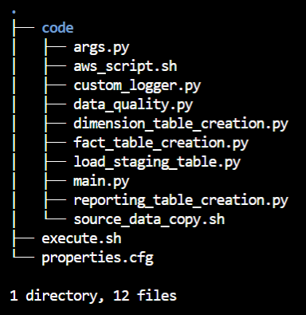
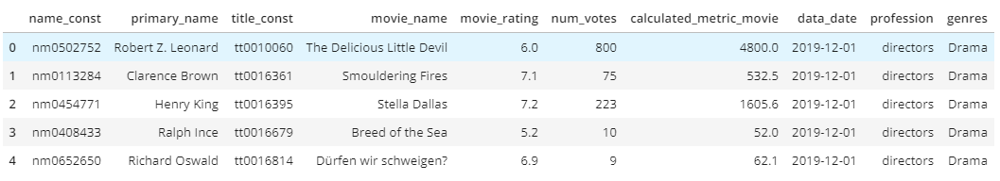
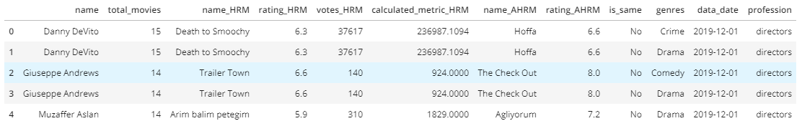

## Background Information & Purpose
This project uses openly available data of IMDb (https://www.imdb.com/). The intent of this project is to find the best movie and rank them based on a calculated metric or on ratings naively for any given crew member (directors/writers). Finally aggregating this data in a reporting table side by side.  
The top most movies from calculated metric and from ratings are combined in a single row. This data is further divided by genres and profession of crew members.  
According to IMDb, the data is modified every day and hence a `data_date` partition is associated with every table.
***
## Technology Stack
* Apache Spark
* AWS S3
* AWS EMR
***
## Running Instruction
Update `properties.cfg` file.  
Execute `sh execute.sh`.  
  
For testing purposes, execute `python code/main.py` instead of execute.sh. 

<b>properties.cfg</b> usage notes:
<ul>
    <li>Partition - Data Date for the run, if not defined code will consider execution date.</li>
    <li>run_mode - Decides which set of property to choose. Currently supported S3|local. If undefined or incorrect, local is set by default.</li>
    <li>SOURCE_CODE_S3 - Supported in S3 mode. Intermediate source code location.</li>
    <li>AWS - Connection details for AWS. </li>
    <li>Directories - Ending with <code>_dir</code>. Intermediate location for storing parquet files.</li>
</ul>

***
    
## Source Code Files
  
<ul>
<li></li>
<ul>
    <li><b>execute.sh -</b> Shell Script for initiating the entire process.</li>
    <li><b>properties.cfg -</b> Configuration file, containing AWS Keys and all required params.</li>
    <li><b>code/ -</b> Directory containing the entire code that will be executed from EMR. Below are files within this dir.</li>
    <ul>
        <li><b>aws_script.sh -</b> Script that is executed as a step within EMR, that pushes code to EMR and runs <i>main.py</i>.</li>
        <li><b>main.py -</b> Python driver script, controls the ETL execution flow.</li>
        <li><b>args.py -</b> Arguments population script. Takes property values from config file and instantiate variables.</li>
        <li><b>load_staging_table.py -</b> Load the <i>.tsv.gz</i> files downloaded from IMDb as parquet files with appropriate schema and data structure.</li>
        <li><b>dimension_table_creation.py -</b> Python script for converting the staging tables to multiple intermediate dimension tables.</li>
        <li><b>fact_table_creation.py -</b> Python script for joining multiple dimension tables to create a single fact table.</li>
        <li><b>reporting_table_creation.py -</b> Python script for extracting only the reportable data from Fact table </li>
        <li><b>data_quality.py -</b> Data Quality Check script. Running multiple ad-hoc data analysis checks.</li>
        <li><b>custom_logger.py -</b> Python script for logging. Any changes for logging here will easily be reflected on entire project.</li>
        <li><b>source_data_copy.sh -</b> Runs only in S3 mode, downloads data from IMDb into HDFS for processing and then archives to S3.</li>
    </ul>
</ul>
</ul>

***
## ETL Flow

<h3>
    <mark>LoadStagingTable</mark> → 
    <mark>DimensionTableCreation</mark> → 
    <mark>FactTableCreation</mark> → 
    <mark>ReportingTableCreation</mark>
</h3>

 
<ul>
    <li><b>LoadStagingTable</b> <code>[load_staging_table.py]</code> <b>-</b> </li>
    <ul><li>First step in the ETL, conversion of source <i>.tsv.gz</i> files to parquet files with appropriate schema and data structure.</li></ul>
    <li><b>DimensionTableCreation</b>  <code>[dimension_table_creation.py]</code> <b>-</b> </li>
    <ul><li> Converts each table into multiple intermediate tables to be further used in the creation of the Fact table. </li></ul>
    <li><b>FactTableCreation</b>  <code>[fact_table_creation.py]</code> <b>-</b> </li>
    <ul><li> Creates fact tables by joining and filtering data from dimension tables.</li></ul>
    <li><b>ReportingTableCreation</b>  <code>[reporting_table_creation.py]</code> <b>-</b> </li>
    <ul><li> Last step of ETL conversion, transforms the fact data into the reportable format.</li></ul>
</ul>

***
## Source Files
Subsets of IMDb data are available for access to customers for personal and non-commercial use.   
<b>• Data Location</b>  
The dataset files can be accessed and downloaded from https://datasets.imdbws.com/. The data is refreshed daily.   
<b>• IMDb Dataset Details</b>  
Each dataset is contained in a gzipped, tab-separated-values (TSV) formatted file in the UTF-8 character set. The first line in each file contains headers that describe what is in each column. A ‘\N’ is used to denote that a particular field is missing or null for that title/name.   

Below are the file name and structures with counts as on <i>December 2019</i>.
* <b>title.basics.tsv.gz</b> (Counts- 6,316,473)
|Column|Data Format|Description
|---|---|---
|tconst | string | alphanumeric unique identifier of the title     
|titleType | string | the type/format of the title (e.g. movie, short, tvseries, tvepisode, video, etc)   
|primaryTitle | string | the more popular title / the title used by the filmmakers   
|originalTitle | string | original title, in the original language   
|isAdult | boolean | 0: non-adult title; 1: adult title   
|startYear | YYYY | represents the release year of a title. In the case of TV Series, it is the series start year
|endYear | YYYY | TV Series end year. ‘\N’ for all other title types   
|runtimeMinutes |numeric| primary runtime of the title, in minutes   
|genres | string array | includes up to three genres associated with the title   

* <b>title.crew.tsv.gz</b> (Counts- 6,316,473)
|Column|Data Format|Description
|---|---|---
|tconst | string | alphanumeric unique identifier of the title
|directors | array of nconsts | director(s) of the given title
|writers | array of nconsts | writer(s) of the given title

* <b>title.ratings.tsv.gz</b> (Counts- 992,341)
|Column|Data Format|Description
|---|---|---
|tconst | string | alphanumeric unique identifier of the title
|averageRating | decimal | weighted average of all the individual user ratings
|numVotes | numeric | number of votes the title has received

* <b>name.basics.tsv.gz</b> (Counts- 9,702,445)
|Column|Data Format|Description
|---|---|---
|nconst | string | alphanumeric unique identifier of the name/person
|primaryName | string | name by which the person is most often credited
|birthYear | YYYY | 
|deathYear | YYYY | if applicable, else '\N'
|primaryProfession | array of strings | the top-3 professions of the person
|knownForTitles | array of tconsts | titles the person is known for

***
## Fact Table
<h3>movie_rating_fact</h3>

|Column|Data Type|Description|Data Range/Format|Partition
|---|---|---|---|:---:
|name_const | string | IMDb generated unique ID for name/person | nm[0-9]* |
|primary_name | string | Name by which the person is most often credited | | 
|title_const | string | IMDb generated unique ID for movies | tt[0-9]* |
|movie_name | string | Popular title of the movie | | 
|movie_rating | double | average of all the individual user ratings for that movie  | 0.0 - 10.0 | 
|num_votes | integer | number of votes the movie has received | |
|calculated_metric_movie | double | Calculated Metric of the movie, to be further used for ranking | |
|data_date | date | Date of data on which ETL was executed | YYYY-MM-DD | ✓
|profession | string | Contribution role of crew member in the title  | directors / writers | ✓
|genres | string | Category of the movie | | ✓

<b>• Sample Data:</b>   
  
***
## Reporting Table
<h4>highest_rated_movie_report</h4>        

|Column|Data Type|Description|Partition
|---|---|---|:---:
|name | string | Crew member name, name of directors/writers |
|total_movies | long | Total number of movies accounted for |
|name_HRM | string | Name of the highest rated movie(HRM) as per calculated metric  |
|rating_HRM | double | Rating of the highest rated movie  | 
|votes_HRM | integer | Number of votes accumulated for the highest rated movie  | 
|calculated_metric_HRM | double | Calculated metric of the highest rated movie | 
|name_AHRM | string | Name of actual highest rated movie(AHRM) based on ratings naively | 
|rating_AHRM | double | Rating of the actual highest rated movie  | 
|is_same | string | Values - Yes / No, If both HRM and AHRM movie name are same | 
|genres | string | Category in which calculation of movies is done | 
|data_date | date |Date of data on which ETL was executed, for daily changing data | ✓
|profession | string |  Values - directors / writers, profession of crew member | ✓

<b>• Sample Data:</b>    
  

***
## Future Scope / Scenarios
* <b>If data was increased by 100x </b>    
Processing clusters in this project are created using Amazon EMR, which provides an easy scalability solution with respect to number of nodes and specification of systems. More details could be found here, https://aws.amazon.com/emr/. With respect to this project, changing `instance-count` within execute.sh while creating an EMR cluster would increase the number of nodes.
 

* <b>If pipelines would be run on a daily basis by 7 am every day </b>   
As of now there is no out of the box solution but the project is modular and integrating with Airflow or converting it to a Cron job would be fairly easy. For reference of airflow, check here, https://github.com/apache/airflow.

* <b>If database needed to be accessed by 100+ people </b>   
Having multiple nodes within the EMR cluster increases concurrency. EMR also provides access via SSH and native support for jupyter notebooks.

* <b>Additional reporting tables</b>   
Current ETL pipeline filter all non-movie data. An extension of current ETL would be to include the remaining titleType like TV Series with this as a separate partition.     
Just like the existing Fact table, code for `tv_fact_table` could be added which would report, highest rated episode and highest rated season for TV titles.

***
